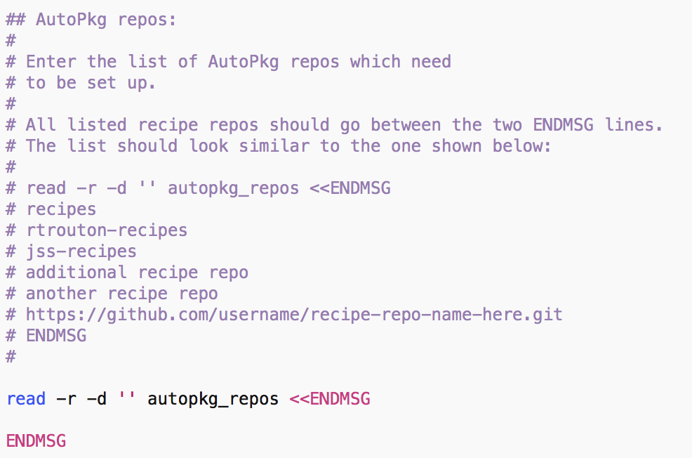
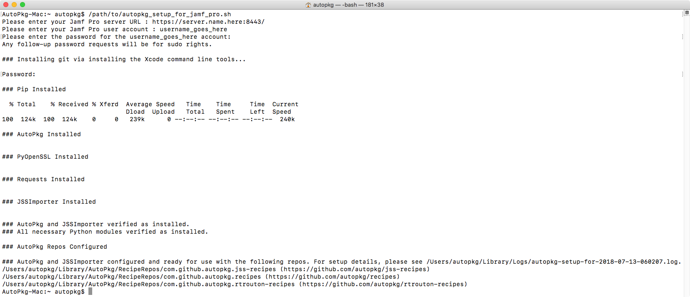
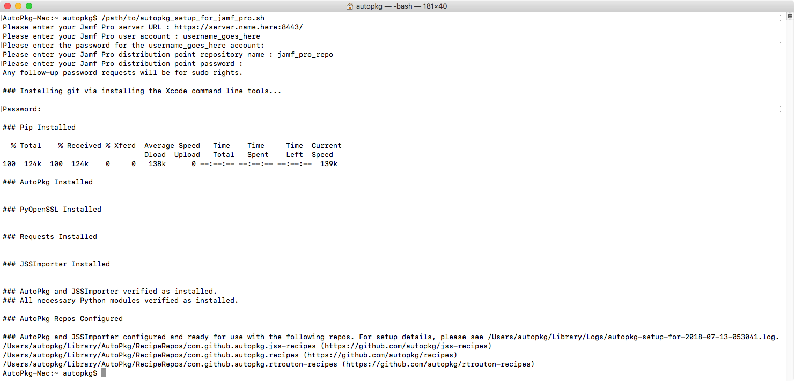

# AutoPkg Setup Script for Jamf Pro

This script is designed to set up a Mac running macOS 10.13.x or later to be able to run the following:

* `git`
* `AutoPkg`
* `JSSImporter`

It also installs the following Python tools and modules:

* `pip`
* `cryptography`
* `requests`

Once these tools and modules are installed, the script configures AutoPkg to use the AutoPkg recipe repos specified in the `autopkg_repos` variable:

If the script is successfully run, the script output should look similar to what is shown below. 

If a Jamf Pro cloud distribution point is set as the master distribution point:

If a Jamf Pro file share distribution point is set as the master distribution point:

The script's actions are logged and are stored in `~/Library/Logs`. The log's filename will be similiar to the file name shown below:

`autopkg-setup-for-2018-07-05-123136.log`
